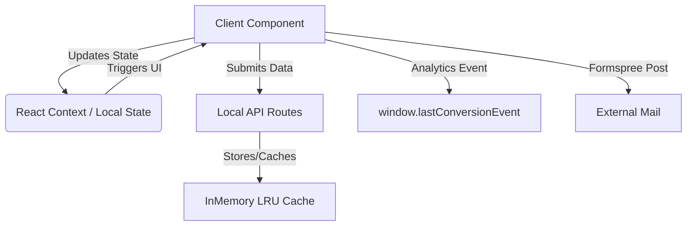

# Lindener Ratsstuben - Architektur & Struktur

Dies ist die Architektur-Dokumentation für `Lindener-Ratsstuben-main` nach Phase 20 der Antigravity Pipeline.

## 1. Component Hierarchy Tree

Die Komponenten sind strikt in Domänen und Layout-Typen separiert.

```text
src/
├── app/                  # Next.js App Router (pages)
├── components/
│   ├── ui/               # Base Building Blocks (Buttons, Inputs, Cards)
│   ├── layout/           # Page Wrappers (Header, Footer, Grid)
│   ├── sections/         # Complex Page Segments (Hero, Pricing, FAQs)
│   ├── forms/            # Interactive Client Forms (Contact/Reservation)
│   ├── navigation/       # Navigation & Breadcrumbs
│   └── shared/           # Error Boundaries, Loading Skeletons
├── lib/                  # Pure Utility Functions
├── hooks/                # Custom React Hooks
├── data/                 # Datensätze & Konstanten
└── styles/               # Tailwind & CSS Tokens
```

## 2. Rendering Strategie

Das Projekt verwendet eine **hybride** Next.js App Router Architektur:
- **SSR (Server-Side Rendering)** wird für die API Routen (`/api/monitoring/*`, `/api/health`) genutzt.
- **SSG (Static Site Generation)** wird als Default für alle Public Routes verwendet (`/`, `/menu`, `/contact`, `/gallery`).
- **CSR (Client-Side Rendering)** wird minimal-invasiv für interaktive Komponenten wie Carousels und den Conversion State (Behavioral Targeting) eingebunden. Client-Komponenten haben den `'use client'` Directive.

## 3. Data Flow



## 4. SSOT Direktiven (Single Source of Truth)

- **Styles:** Alle Farben, Spacings und Typografie-Definitionen liegen nativ in Markdown/CSS, gesteuert via standardisierter Tailwind Config. Magic Numbers in inline-Styles sind streng verboten.
- **State:** Pipeline State lebt isoliert in `.pipeline-master-state.md`. Keine andere File darf Master-Verwaltung spielen.
- **Types:** Typescript Typisierungsdefinitionen liegen zentral in `src/types` oder gekapselt über den UI-Komponenten Interfaces. `any` Typisierung ist verboten (Phase 20 Zero Any Law).
